# Работа с Git

## Работа в командной строке

1. 
```
$ git init
Initialized empty Git repository in D:/repo/.git/
```
Инициализирует git (появляется папка .git).
<br>
<br>  

2. 
```
$ git status
On branch master

No commits yet

nothing to commit (create/copy files and use "git add" to track)
```
Отображает состояние репозитория. Пока никакие действия не производились.
<br>
<br>

3. 
```
$ touch file.txt

$ nano file.txt

$ git status
On branch master

No commits yet

Untracked files:
  (use "git add <file>..." to include in what will be committed)
        file.txt

nothing added to commit but untracked files present (use "git add" to track)
```
Файл создан, но еще не отслеживается системой (untracked).
<br>
<br>

4. 
```
$ git add file.txt

$ git status
On branch master

No commits yet

Changes to be committed:
  (use "git rm --cached <file>..." to unstage)
        new file:   file.txt
```
Теперь файл отслеживаемый (unstaged).
<br>
<br>

5. 
```
$ git commit -m "Fisrt file"
[master (root-commit) e5fd03f] Fisrt file
 1 file changed, 1 insertion(+)
 create mode 100644 file.txt

$ git status
On branch master
nothing to commit, working tree clean

```
Фиксирует текущее состояние файла (staged).
<br>
<br>

6. 
```
$ nano file.txt

$ git status
On branch master
Changes not staged for commit:
  (use "git add <file>..." to update what will be committed)
  (use "git restore <file>..." to discard changes in working directory)
        modified:   file.txt

no changes added to commit (use "git add" and/or "git commit -a")

$ git add file.txt

$ git status
On branch master
Changes to be committed:
  (use "git restore --staged <file>..." to unstage)
        modified:   file.txt


$ git commit -m "Fisrt file"
[master 6a90243] Fisrt file
 1 file changed, 1 insertion(+), 1 deletion(-)
```
Если еще раз изменить файл, он снова станет unstaged. Возвращаем файл в staging area. После коммита старый файл заменяется на новый изменённый.
<br>
<br>

7. 
```
$ git remote add origin https://github.com/aiseeeeel/aiseeeeel.github.io.git

$ git push -u origin master
Enumerating objects: 6, done.
Counting objects: 100% (6/6), done.
Delta compression using up to 20 threads
Compressing objects: 100% (2/2), done.
Writing objects: 100% (6/6), 435 bytes | 435.00 KiB/s, done.
Total 6 (delta 0), reused 0 (delta 0), pack-reused 0 (from 0)
remote:
remote: Create a pull request for 'master' on GitHub by visiting:
remote:      https://github.com/aiseeeeel/aiseeeeel.github.io/pull/new/master
remote:
To https://github.com/aiseeeeel/aiseeeeel.github.io.git
 * [new branch]      master -> master
branch 'master' set up to track 'origin/master'.
```
Добавляет удалённый репозиторий к локальному. Выгрузка файлов из локального репозиторию в удалённый.
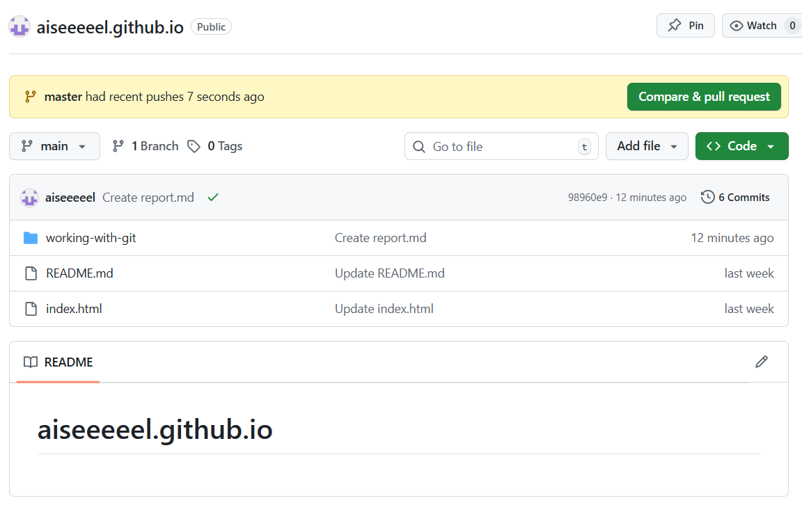
<br>
<br>

8. Внести изменения в файл на сайте GitHub.
```
$ git pull origin master
remote: Enumerating objects: 5, done.
remote: Counting objects: 100% (5/5), done.
remote: Total 3 (delta 0), reused 0 (delta 0), pack-reused 0 (from 0)
Unpacking objects: 100% (3/3), 894 bytes | 55.00 KiB/s, done.
From https://github.com/aiseeeeel/aiseeeeel.github.io
 * branch            master     -> FETCH_HEAD
   6a90243..70d62f3  master     -> origin/master
Updating 6a90243..70d62f3
Fast-forward
 file.txt | 1 +
 1 file changed, 1 insertion(+)

$ nano file.txt

$ git diff HEAD
diff --git a/file.txt b/file.txt
index 8c48baf..a37f563 100644
--- a/file.txt
+++ b/file.txt
@@ -1,2 +1,3 @@
 Hello!!! Hello!!!
 Hello!!! Hello!!!
+Hello.
```
Вытягивает изменения в файле из удалённого репозитория. Вносит изменения в файл через командную строку. Сравнивает зафиксированный файл, скопированный с удалённого репозитория, и ещё не зафиксированные изменения в локальном репозитории.
<br>
<br>

9. 
```
$ mkdir folder

$ touch folder/bye.txt

$ git status
On branch master
Your branch is up to date with 'origin/master'.

Changes not staged for commit:
  (use "git add <file>..." to update what will be committed)
  (use "git restore <file>..." to discard changes in working directory)
        modified:   file.txt

Untracked files:
  (use "git add <file>..." to include in what will be committed)
        folder/

no changes added to commit (use "git add" and/or "git commit -a")

$ git add folder/bye.txt

$ git status
On branch master
Your branch is up to date with 'origin/master'.

Changes to be committed:
  (use "git restore --staged <file>..." to unstage)
        new file:   folder/bye.txt

Changes not staged for commit:
  (use "git add <file>..." to update what will be committed)
  (use "git restore <file>..." to discard changes in working directory)
        modified:   file.txt

$ git diff --staged
diff --git a/folder/bye.txt b/folder/bye.txt
new file mode 100644
index 0000000..e69de29
```
Создаёт директорию и файл в ней. Делает файл отслеживаемым. Позволяет посмотреть на изменения, сделанные в staged.
<br>
<br>

10. 
```
$ git reset folder/bye.txt
Unstaged changes after reset:
M       file.txt

$ git diff --staged

$ git diff
diff --git a/file.txt b/file.txt
index 8c48baf..a37f563 100644
--- a/file.txt
+++ b/file.txt
@@ -1,2 +1,3 @@
 Hello!!! Hello!!!
 Hello!!! Hello!!!
+Hello.
```
Удаляет файл из staged. Файл остался прежним.
<br>
<br>

11. 
```
$ git branch branch

$ git branch
  branch
* master

$ git checkout branch
M       file.txt
Switched to branch 'branch'
```
Создаёт новую ветку (копия репозитория). Показывает существующие ветки. Переключает на выбранную ветку.
<br>
<br>

12. 
```
$ rm -r folder

$ git commit -m 'Delete folder and file'
On branch branch
nothing to commit, working tree clean
```
Удаляет файлы внутри ветки.
<br>
<br>

13. 
```
$ git checkout master
Switched to branch 'master'
Your branch is up to date with 'origin/master'.

$ git merge branch
Updating 70d62f3..6ff16fa
Fast-forward
 file.txt | 1 -
 1 file changed, 1 deletion(-)

$ git branch -d branch
Deleted branch branch (was 6ff16fa).
```
Переключает на главную ветку. Делает слияние с другой веткой. Удаляет ветку.
<br>
<br>

## Работа в GitHub Desktop

1. 'git init'
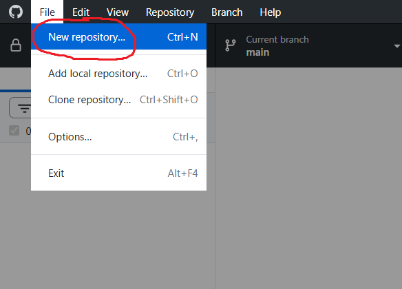
<br>
<br>

2. 'git add file.txt'
Галочками в чекбоксах отмечаются stage файлы.
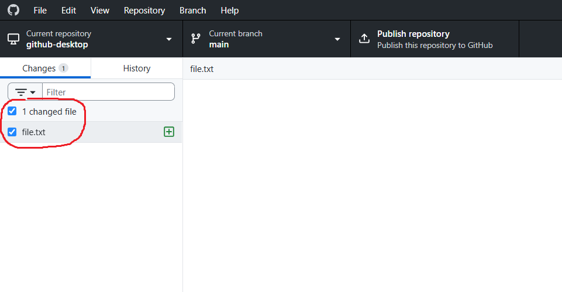
<br>
<br>

3. 'git commit -m "First file"'
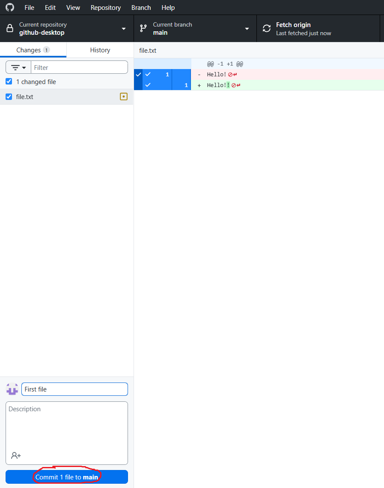
<br>
<br>

4. 'git push'
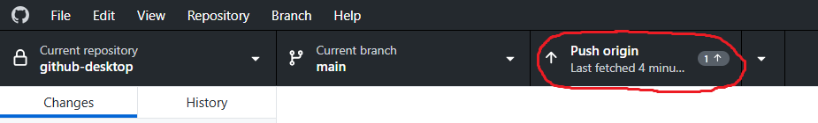
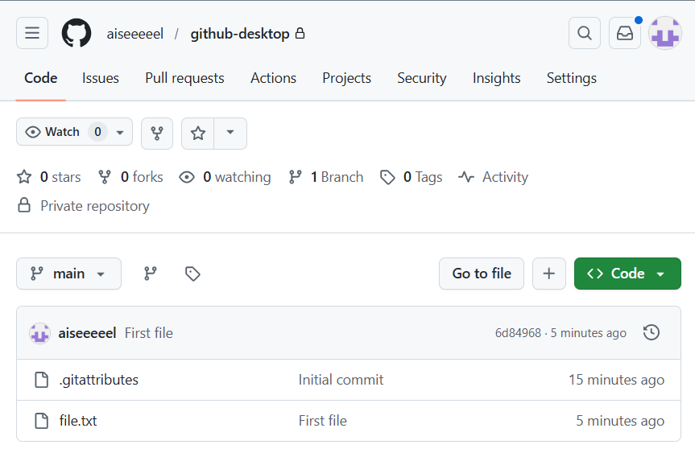
<br>
<br>

5. 'git pull'
Сначала изменяю файл на GitHub.
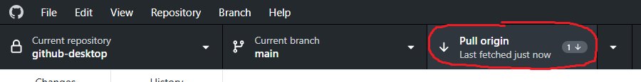
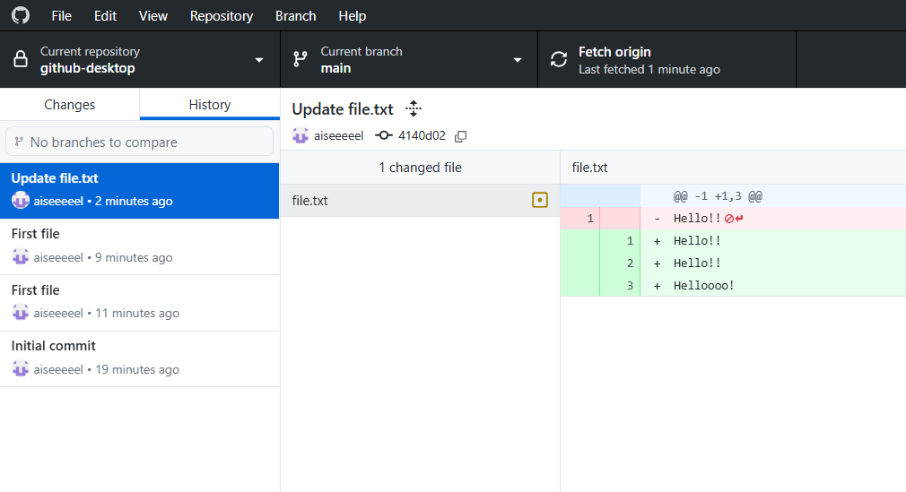
<br>
<br>

6. 'git branch branch'
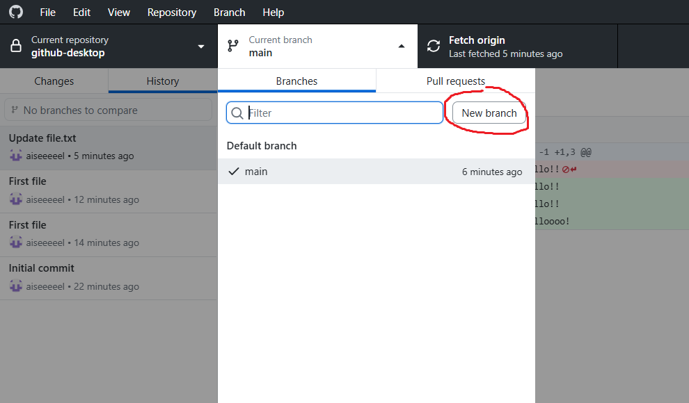
Переключение между ветками осуществляется нажатием.
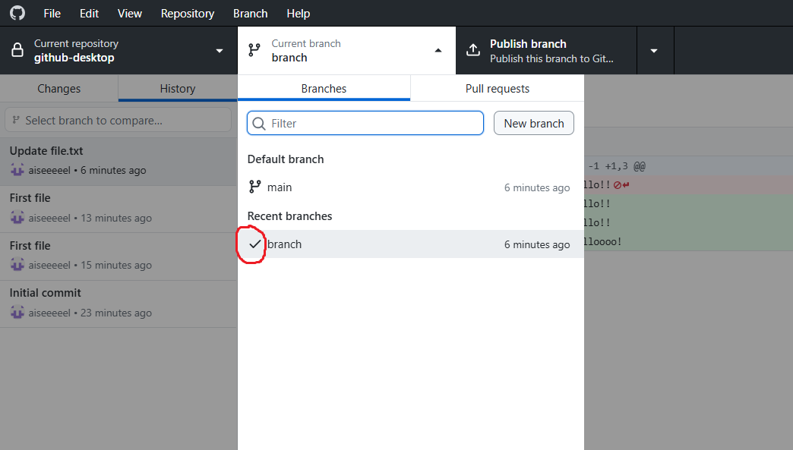
<br>
<br>

7. 'rm -r folder' и 'git commit -m 'Delete folder and file''
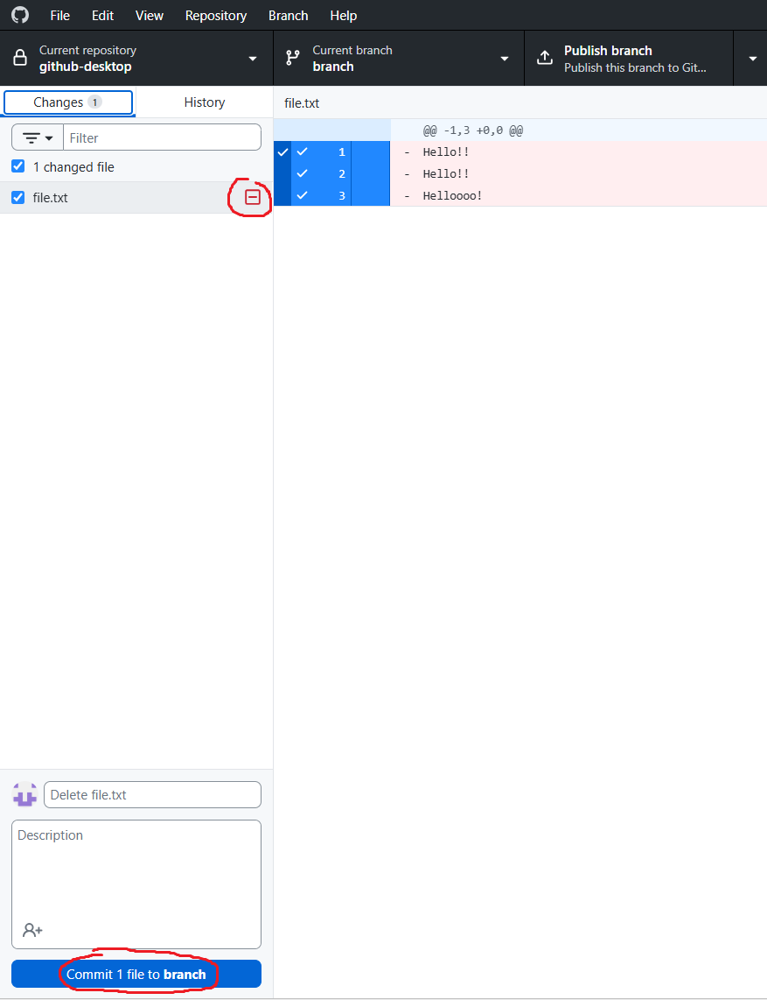

<br>
<br>
8. 'git merge branch'
Сначала переключаемся на главную ветку.
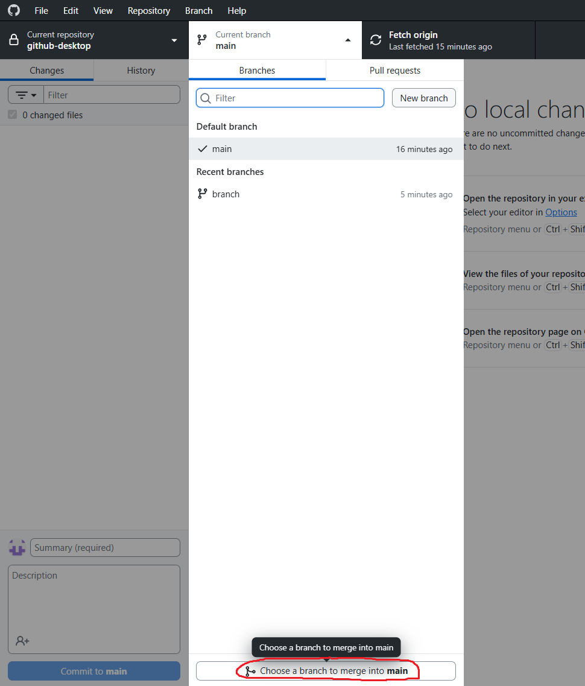
Выбираем ветку для слияния.
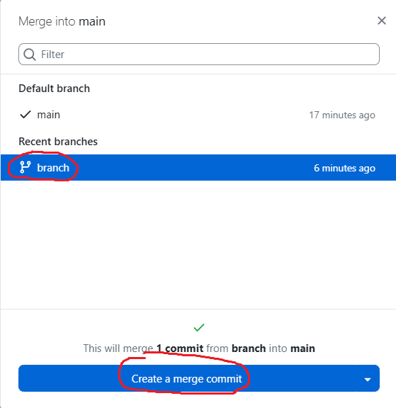

9. git branch -d branch
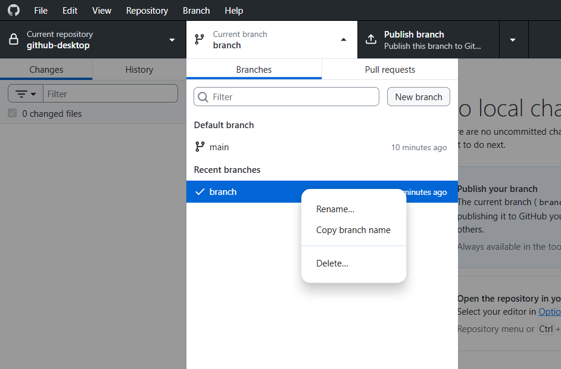
